# Generative Modeling via Drifting — JAX & PyTorch Release

<p align="center">
  <a href="http://arxiv.org/abs/2602.04770"></a>
  <a href="https://colab.research.google.com/github/lambertae/drifting/blob/main/notebooks/inference_demo.ipynb"></a>
  <a href="https://huggingface.co/Goodeat/drifting"></a>
</p>

<p align="center">
  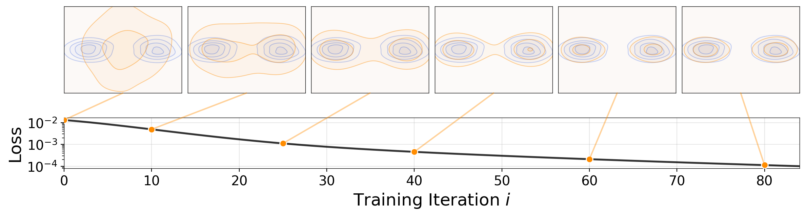
</p>

Official codebase for the ImageNet experiments of *Generative Modeling via Drifting*.
We provide training, inference, and pretrained weights for one-step image generation on ImageNet 256×256.

This repository contains **two independent implementations** of the Drift framework:

| Directory | Backend | Status |
|-----------|---------|--------|
| [`jax/`](jax/) | JAX + Flax (original) | Pretrained weights available |
| [`torch/`](torch/) | PyTorch | Re-implementation |

Root-level directories (`assets/`, `configs/`, `notebooks/`) are shared between both implementations.

## Generated Samples

Uncurated conditional ImageNet 256×256 samples (1 NFE, CFG scale 1.0, FID 1.54):

<p align="center">
  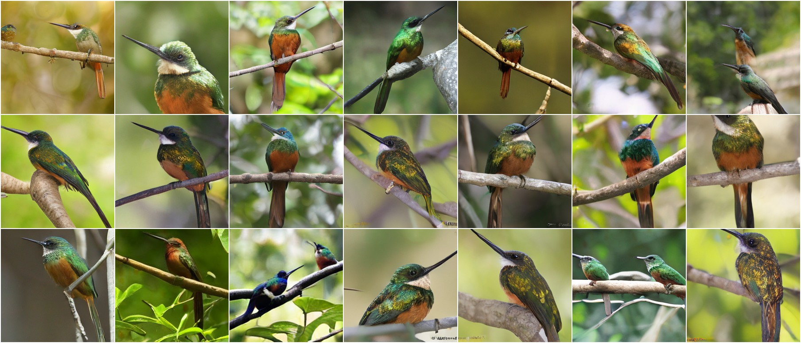
  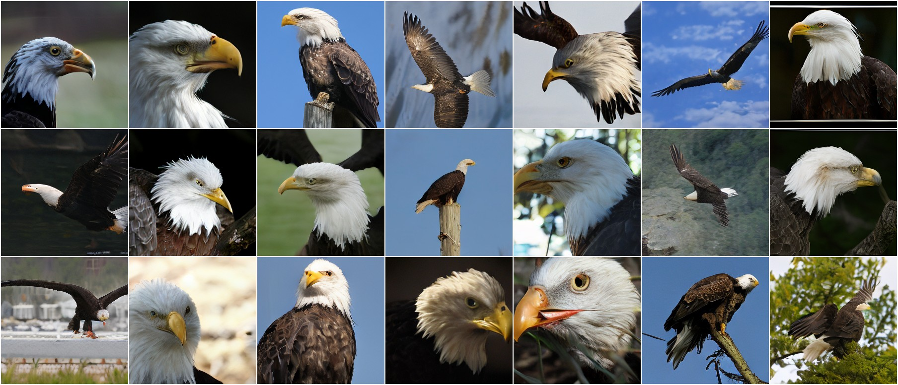
  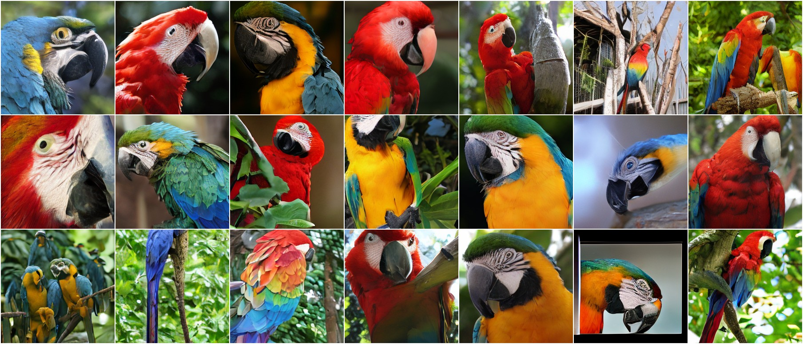
  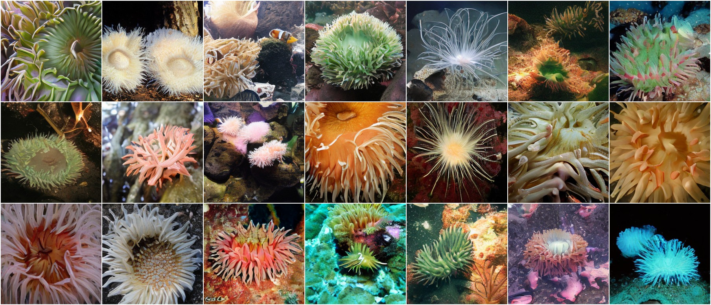
</p>
<p align="center">
  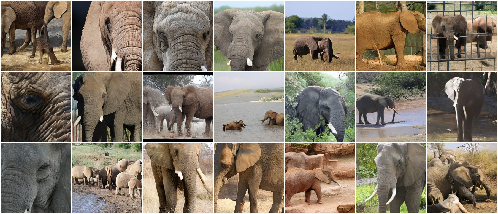
  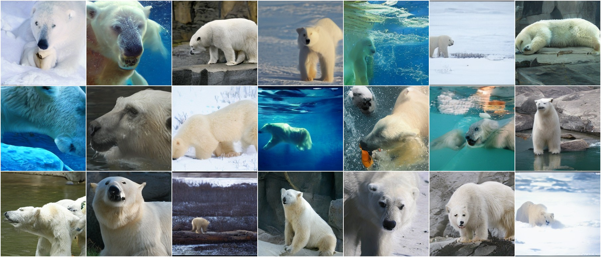
  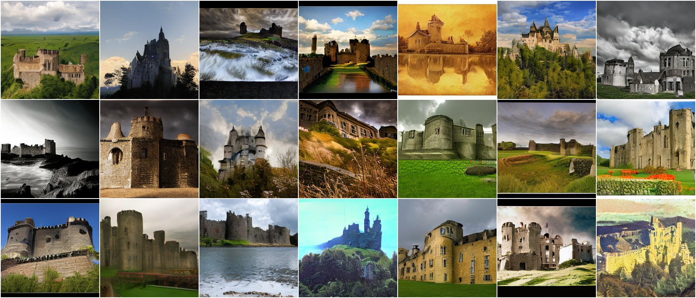
  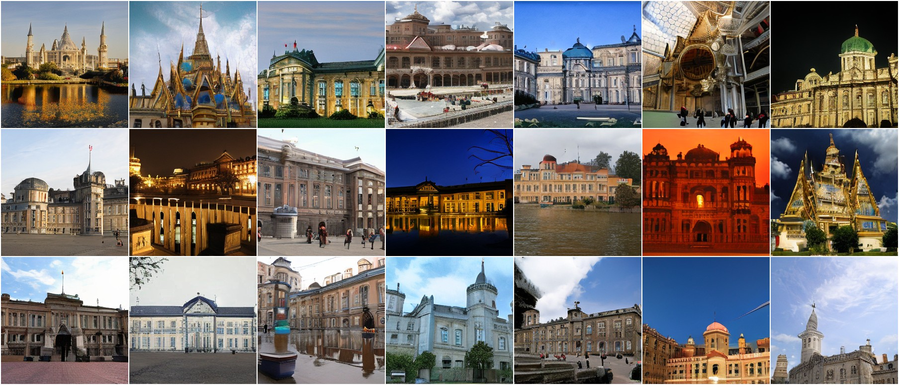
</p>
<p align="center">
  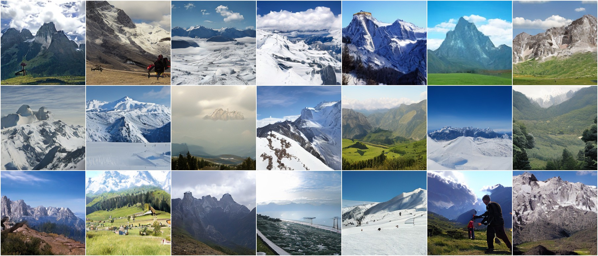
  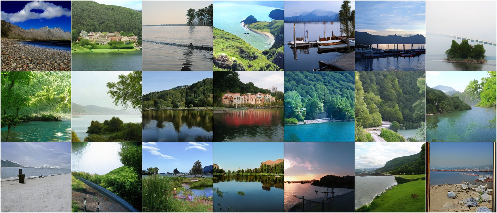
  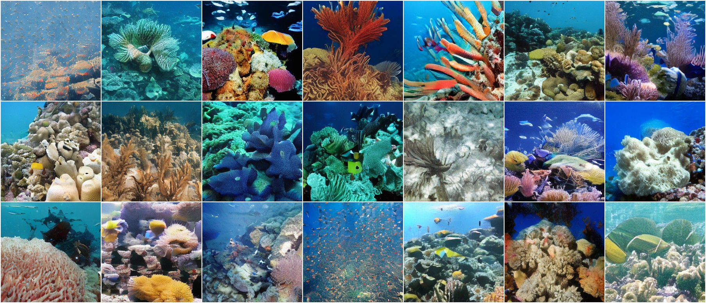
  
</p>

## Training Dynamics

The generated distribution **q** evolves toward the data distribution **p** during training.
Try the interactive toy demo to see the algorithm in action:

[](https://colab.research.google.com/github/lambertae/lambertae.github.io/blob/main/projects/drifting/notebooks/drifting_model_demo.ipynb)

<table align="center">
  <tr>
    <th align="center">Middle Init</th>
    <th align="center">Far-Away Init</th>
    <th align="center">Collapsed Init</th>
  </tr>
  <tr>
    <td align="center"></td>
    <td align="center"></td>
    <td align="center"></td>
  </tr>
</table>

---

## Table of Contents

- [Repository Structure](#repository-structure)
- [Quick Start (Inference)](#quick-start-inference)
- [Pretrained Models](#pretrained-models)
- [Environment Setup](#environment-setup)
- [FID Evaluation](#fid-evaluation)
- [Training](#training)
- [Checkpoints and Logs](#checkpoints-and-logs)
- [Citation](#citation)

## Repository Structure

```
.
├── assets/              # Images and GIFs used in README
├── configs/             # Shared YAML configs for gen/mae training
│   ├── gen/
│   └── mae/
├── notebooks/           # Colab inference demo
├── jax/                 # JAX + Flax implementation (original)
│   ├── dataset/
│   ├── models/
│   ├── utils/
│   ├── drift_loss.py
│   ├── memory_bank.py
│   ├── train.py
│   ├── train_mae.py
│   ├── inference.py
│   ├── main.py
│   └── requirements.txt
└── torch/               # PyTorch re-implementation
    ├── dataset/
    ├── models/
    ├── utils/
    ├── drift_loss.py
    ├── memory_bank.py
    ├── train.py
    ├── train_mae.py
    ├── inference.py
    ├── main.py
    └── requirements.txt
```

## Quick Start (Inference)

The self-contained Colab notebook lets you generate samples interactively — no local setup required:

[](https://colab.research.google.com/github/lambertae/drifting/blob/main/notebooks/inference_demo.ipynb)

Default notebook configuration:

- `init_from = hf://latent_L_sota`
- `class_ids = 95,22,88,108,386,296,483,698`

Class indices follow the ImageNet-1k label order.

## Pretrained Models

### Generators

| Model    | Space  | Feature Encoder  | Encoder HF ID           | Generator HF ID      | CFG | FID (repo / paper) | IS (repo / paper) |
| -------- | ------ | ---------------- | ----------------------- | -------------------- | --- | ------------------ | ----------------- |
| Drift-L  | latent | MAE-640 (latent) | `hf://mae_latent_640`   | `hf://latent_L_sota` | 1.0 | 1.53 / 1.54        | 260.1 / 258.9     |
| Drift-B  | latent | MAE-640 (latent) | `hf://mae_latent_640`   | `hf://latent_B_sota` | 1.1 | 1.74 / 1.75        | 263.4 / 263.2     |
| Drift-L  | pixel  | MAE-640 (pixel)  | `hf://mae_pixel_640`    | `hf://pixel_L_sota`  | 1.0 | 1.62 / 1.61        | 308.6 / 307.5     |
| Drift-B  | pixel  | MAE-640 (pixel)  | `hf://mae_pixel_640`    | `hf://pixel_B_sota`  | 1.0 | 1.73 / 1.76        | 300.1 / 299.7     |
| Ablation | latent | MAE-256 (latent) | `hf://mae_latent_256`   | `hf://ablation`      | 2.0 | 8.49 / 8.46        | 144.0 / —         |

### Feature Extractors

| Model              | Space  | HF ID                 |
| ------------------ | ------ | --------------------- |
| MAE-640 (latent)   | latent | `hf://mae_latent_640` |
| MAE-640 (pixel)    | pixel  | `hf://mae_pixel_640`  |
| MAE-256 (ablation) | latent | `hf://mae_latent_256` |

All artifacts are hosted on HuggingFace at [`Goodeat/drifting`](https://huggingface.co/Goodeat/drifting) and are downloaded automatically.

## Environment Setup

### JAX Implementation

```bash
conda create -n drifting-jax python=3.10 -y
conda activate drifting-jax
pip install -r jax/requirements.txt
export JAX_PLATFORMS=tpu,cpu
```

### PyTorch Implementation

```bash
conda create -n drifting-torch python=3.10 -y
conda activate drifting-torch
pip install -r torch/requirements.txt
```

### Install Dependencies (Legacy — JAX)

```bash
conda create -n drifting-release python=3.10 -y
conda activate drifting-release
pip install -r jax/requirements.txt
export JAX_PLATFORMS=tpu,cpu
```

For local TPU runs, keep `JAX_PLATFORMS=tpu,cpu` in the shell before running
latent-cache building, training, or evaluation. This keeps TPU as the default
backend while still exposing a CPU backend for Flax VAE / checkpoint restore
paths that expect it.

### Download ImageNet

Download the [ImageNet](https://image-net.org/download) dataset and extract it to your desired location. The dataset should have the following structure:

```
imagenet/
├── train/
│   ├── n01440764/
│   ├── n01443537/
│   └── ...
└── val/
    ├── n01440764/
    ├── n01443537/
    └── ...
```

### Path Configuration

Before running training or evaluation, open `jax/utils/env.py` (or `torch/utils/env.py` for PyTorch) and set these constants for your machine:

- `IMAGENET_PATH`: root of the ImageNet directory (expects `train/` and `val/` subdirectories).
- `IMAGENET_CACHE_PATH`: root of the latent cache directory (only needed for latent-generator training).
- `IMAGENET_FID_NPZ`: path to the ImageNet-256 FID reference stats `.npz`.
- `IMAGENET_PR_NPZ`: path to the ImageNet precision/recall reference stats `.npz`.
- `HF_ROOT`: local cache directory for downloaded HuggingFace artifacts.
- `HF_REPO_ID`: HuggingFace repo ID for the release checkpoints (keep as `Goodeat/drifting`).

FID/PR reference stats can be downloaded from [Google Drive](https://drive.google.com/drive/folders/1Tr_6PXF2WMYkSlCbbkP_0FRhEjAXx5gb) (migrated from MeanFlow).

### Build Latent Cache

Only needed for latent-space generators. Run from the `jax/` directory:

```bash
cd jax
python -m dataset.latent \
  --data-path /path/to/imagenet \
  --target-path /path/to/latent_cache \
  --local-batch-size 128 \
  --num-workers 8 \
  --pin-memory
```

This encodes ImageNet images through the VAE and writes `.pt` files to `/path/to/latent_cache/{train,val}/`. After building the cache, update `IMAGENET_CACHE_PATH` in `utils/env.py`.

## FID Evaluation

### JAX

Reproduce paper FID numbers on ImageNet-256 (50k samples, CFG=1.0):

```bash
cd jax
# Latent model
python inference.py --init-from "hf://latent_L_sota" --cfg-scale 1.0 \
  --num-samples 50000 --eval-batch-size 256 --json-out results_latent.json

# Pixel model
python inference.py --init-from "hf://pixel_L_sota" --cfg-scale 1.0 \
  --num-samples 50000 --eval-batch-size 256 --json-out results_pixel.json
```

### PyTorch

```bash
cd torch
python inference.py --init-from /path/to/params_ema --cfg-scale 1.0 \
  --num-samples 50000 --eval-batch-size 256 --json-out results.json
```

To stream metrics and preview images to W&B, add `--use-wandb --wandb-entity YOUR_ENTITY_HERE --wandb-project YOUR_PROJECT_HERE` to either command.

Expected FID numbers match the [Pretrained Models](#pretrained-models) table above. Output JSON contains `fid`, `isc_mean`, `isc_std`, `precision`, `recall`. Precision/recall are only computed when `num_samples >= 50000`.

**Requirements:**

- TPU v4-8 (otherwise reduce `--eval-batch-size` to avoid OOM during VAE decoding)
- ImageNet-256 path configured in `utils/env.py`. Images are generated using the class labels from the ImageNet validation set.
- Precomputed FID/PR reference stats configured in `utils/env.py`

## Training

### JAX — Generator Training

```bash
cd jax
python main.py --gen --config ../configs/gen/latent_ablation.yaml --workdir runs/gen_latent_ablation
python main.py --gen --config ../configs/gen/latent_sota_B.yaml   --workdir runs/gen_latent_sota_B
python main.py --gen --config ../configs/gen/latent_sota_L.yaml   --workdir runs/gen_latent_sota_L
python main.py --gen --config ../configs/gen/pixel_sota_B.yaml    --workdir runs/gen_pixel_sota_B
python main.py --gen --config ../configs/gen/pixel_sota_L.yaml    --workdir runs/gen_pixel_sota_L
```

### PyTorch — Generator Training

```bash
cd torch
python main.py --gen --config ../configs/gen/latent_ablation.yaml --workdir runs/gen_latent_ablation
```

### JAX — Generator Training (Details)

```bash
cd jax
python main.py --gen --config ../configs/gen/latent_ablation.yaml --workdir runs/gen_latent_ablation
python main.py --gen --config ../configs/gen/latent_sota_B.yaml   --workdir runs/gen_latent_sota_B
python main.py --gen --config ../configs/gen/latent_sota_L.yaml   --workdir runs/gen_latent_sota_L
python main.py --gen --config ../configs/gen/pixel_sota_B.yaml    --workdir runs/gen_pixel_sota_B
python main.py --gen --config ../configs/gen/pixel_sota_L.yaml    --workdir runs/gen_pixel_sota_L
```

MAE pretrained weights are downloaded automatically from HuggingFace via the `feature.mae_path` config field. No need to train MAE unless experimenting with custom feature extractors.

FID is evaluated during training at intervals set by `train.eval_per_step`.

**Ablation run intermediate FID (EMA model, best CFG):**

| Steps | CFG | FID   |
| ----- | --- | ----- |
| 5k    | 3.5 | 35.20 |
| 10k   | 2.5 | 13.33 |
| 15k   | 2.0 | 10.70 |
| 20k   | 2.0 | 9.47  |
| 25k   | 2.0 | 8.84  |
| 30k   | 2.0 | 8.34  |

We used 64 TPU v6e for the ablation run and 128 TPU v6e for the SOTA runs. Each host maintains its own memory bank (16 hosts for ablation, 32 for SOTA). When using fewer hosts (e.g., DDP on one H100 node = 8 hosts), increase `push_per_step` to keep the memory bank update rate sufficient.

### JAX — MAE Pretraining (Optional)

Pretrained MAE weights are already available at `hf://mae_latent_640`, `hf://mae_latent_256`, and `hf://mae_pixel_640`. Training code is provided for users who want to train their own:

```bash
cd jax
python main.py --config ../configs/mae/latent_ablation_256.yaml --workdir runs/mae_latent_ablation_256
python main.py --config ../configs/mae/latent_640.yaml          --workdir runs/mae_latent_640
python main.py --config ../configs/mae/pixel_640.yaml           --workdir runs/mae_pixel_640
```

### Using a Local MAE Checkpoint as Feature Extractor

1. Train an MAE (see above).
2. Point the generator config at the MAE workdir:

```yaml
feature:
  mae_path: /abs/path/to/runs/mae_latent_640
  use_mae: true
  use_convnext: false
  use_post_x: false
```

3. Run generator training.

## Checkpoints and Logs

### JAX

Each `--workdir <dir>` produces:

```
<dir>/
├── checkpoints/                        # Orbax checkpoints (full training state)
├── params_ema/                         # EMA-only artifact
│   ├── ema_params.msgpack
│   └── metadata.json
└── log/
    ├── metrics.jsonl                   # Metrics (when use_wandb: false)
    └── images/*.jpg                    # Sample preview grids
```

Local artifacts in `params_ema/` can be loaded directly for inference (JAX):

```bash
cd jax
python inference.py --init-from /path/to/workdir --cfg-scale 1.0 \
  --num-samples 50000 --eval-batch-size 256
```

### PyTorch

```
<dir>/
├── checkpoints/                        # torch.save() checkpoints
├── params_ema/                         # EMA params artifact
│   ├── ema_params.pt
│   └── metadata.json
└── log/
    ├── metrics.jsonl
    └── images/*.jpg
```

## Citation

```bibtex
@article{deng2026generative,
  title={Generative Modeling via Drifting},
  author={Deng, Mingyang and Li, He and Li, Tianhong and Du, Yilun and He, Kaiming},
  journal={arXiv preprint arXiv:2602.04770},
  year={2026}
}
```

## Acknowledgments

We thank Hanhong Zhao for sanity checking this repository.
